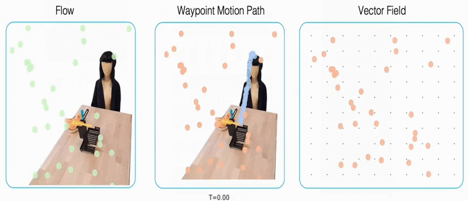

# 🤖🌊 robot manipulation with flow matching

<!---->
<!---->

* Paper page: Affordance-based Robot Manipulation with Flow Matching https://arxiv.org/abs/2409.01083
* Project page: https://hri-eu.github.io/flow-matching-policy/
* Code: https://github.com/HRI-EU/flow_matching
* Author: Fan Zhang (fan.zhang@honda-ri.de), Michael Gienger
<!--* <video src="https://github.com/user-attachments/assets/633d6756-a3ff-4fde-aace-bbf5fbd58866" width="300" autoplay loop muted>-->

